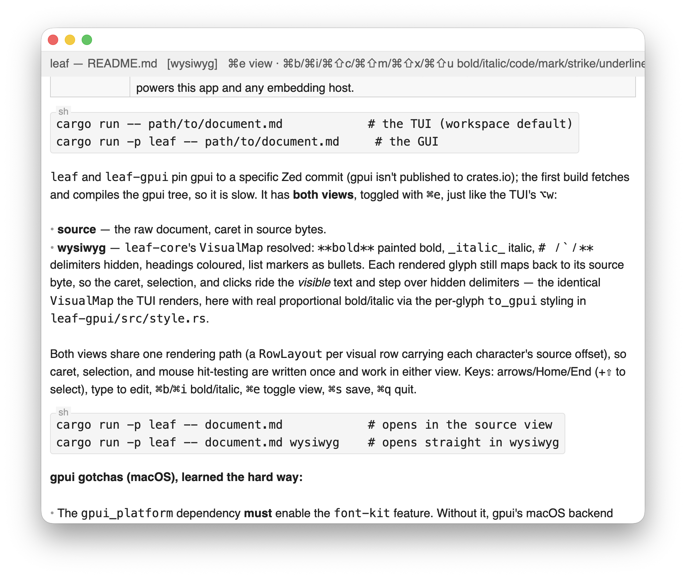

# leaf

A sample document. Select a word and press **Alt+B** to _bold_ it.

todo:
- images
- web selection
- tui enhancements

Hello there! This is a new test!

hello

- edits are `edit_range` splices
- the tree stays valid as you type